# Fifine D6 StreamDock Plugins (macOS & Windows)

Hardware-monitor and Claude plugins for the **Fifine AmpliGame Stream Deck D6**
(and other HotSpot **StreamDock** devices: Ajazz, Mirabox, VSDinside…).

Migrated from the Elgato Node-SDK versions to plain Node.js speaking the
StreamDock WebSocket protocol directly. Each key image is rendered to **PNG**
with [pureimage](https://github.com/joshmarinacci/node-pureimage) (pure JS — no
native binaries) and pushed via `setImage`. Two plugins, each a **category**
with one action per item.

> The D6 has **15 LCD keys (5×3), no dials** — keypad items only.

---

## 🖥️ HWiNFO

Hardware dashboard in three visual styles. Drag any item onto a key.

### Bars

| | | |
|:--:|:--:|:--:|
| 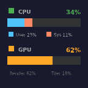 | 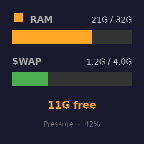 | |
| **CPU / GPU** — usage bars | **Memory** — RAM / swap / pressure | |

### Gauges — radial dial, colored **green / yellow / red** by value

| | | |
|:--:|:--:|:--:|
| 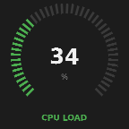 | 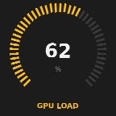 | 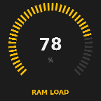 |
| **CPU Load** | **GPU Load** | **RAM Load** |
| 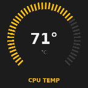 | 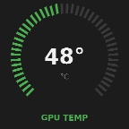 | 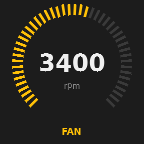 |
| **CPU Temp** ¹ | **GPU Temp** ¹ | **Fan** ² |

### History — current value + sparkline (CPU green, GPU red)

| | | |
|:--:|:--:|:--:|
| 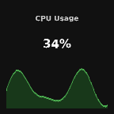 | 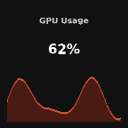 | 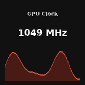 |
| **CPU Usage** | **GPU Usage** | **GPU Clock** |
| 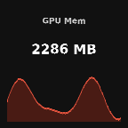 | 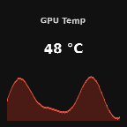 | 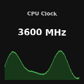 |
| **GPU Mem** | **GPU Temp** ¹ | **CPU Clock** ² |
| 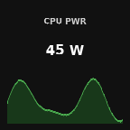 | 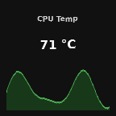 | |
| **CPU PWR** ² | **CPU Temp** ² | |

¹ real °C with the [sensor helper](#-enabling-real-sensors) — on macOS, without
the helper, a 0-100 thermal-level proxy; on Windows, without the helper, ACPI °C
if the board exposes it, else `n/a` &nbsp;·&nbsp; ² needs the sensor helper
(shows `n/a` without it; CPU Clock is live on Windows with no helper)

> **Not available on macOS:** *CPU Volt* — neither `powermetrics` nor (on recent
> macOS) the SMC IOKit interface expose it.

---

## 🟤 Claude

| | | | |
|:--:|:--:|:--:|:--:|
| 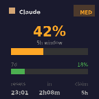 | 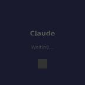 |  |  |
| **Usage** — 5h/7d rate-limit | **Approve** (idle) | **Approve** (pending) | **Approve** (approved) |

- **Usage** — reads the Claude Code OAuth token (macOS Keychain;
  `~/.claude/.credentials.json` on Windows) and polls a 1-token API call for the
  `anthropic-ratelimit-unified-*` headers.
- **Approve** — a physical approve button for Claude Code permission requests via
  a `PermissionRequest` hook (file IPC). Optional wiring — macOS:
  `"<plugin>/postinstall.sh"`; Windows: `"<plugin>\postinstall.ps1"` (wires the
  cross-platform `hooks/claude-approve.js`).

---

## 📦 Build & Install

No Node.js needed on your machine — only **Docker** (both platforms vendor deps
via the `node:20` image; pass `-UseLocalNpm` to `build.ps1` to use a local Node).

### macOS

```bash
# 1. Build all plugins into ./build (vendors deps via node:20 Docker)
./build.sh

# 2. Install onto the host (copies to the StreamDock plugins dir + restarts the app)
cd build && ./install.sh
```

Install path: `~/Library/Application Support/HotSpot/StreamDock/plugins/`.

### Windows (PowerShell)

```powershell
# 1. Build all plugins into .\build (vendors deps via node:20 Docker)
.\build.ps1

# 2. Install onto the host (copies to the StreamDock plugins dir + restarts the app)
cd build; .\install.ps1
```

Install path: `%APPDATA%\HotSpot\StreamDock\plugins\`.

Then open the StreamDock software and drag items from the **HWiNFO** / **Claude**
categories onto keys. On Windows the plugin runs as `plugin/index.js` directly
through the app's bundled Node (`CodePathWin`); data is collected via PowerShell
(CIM perf counters — no admin, locale-independent).

---

## 🔐 Enabling real sensors

CPU/GPU temperature in **°C**, **fan RPM** and **CPU/GPU power** aren't readable
by an unprivileged process. Each OS ships an optional helper that publishes the
values to a JSON the plugin reads (`<tmp>/hwinfo-sensors.json`). Without it the
affected items degrade gracefully (proxy or `n/a`); nothing breaks.

### Windows

Windows has no built-in equivalent of `powermetrics`, so the helper reads a
running sensor provider's WMI namespace and republishes it. Install one of
**[LibreHardwareMonitor]** (preferred) or **OpenHardwareMonitor**, run it **as
administrator** with WMI/remote reporting enabled, then register the daemon
(from an elevated PowerShell):

```powershell
powershell -ExecutionPolicy Bypass -File "$env:APPDATA\HotSpot\StreamDock\plugins\br.com.m4v3r1ck.hwinfo.sdPlugin\helper\install-helper.ps1"
```

It registers a hidden logon Scheduled Task running `helper\sensors-daemon.ps1`,
which writes `%TEMP%\hwinfo-sensors.json`. Uninstall with
`helper\uninstall-helper.ps1`. (CPU clock and CPU/GPU load, RAM and VRAM are live
on Windows **without** any helper.)

[LibreHardwareMonitor]: https://github.com/LibreHardwareMonitor/LibreHardwareMonitor

### macOS — privileged helper (sudo)

CPU/GPU temperature, fan RPM and CPU power/clock are only readable by **root** on
macOS (`powermetrics`). The repo ships a small privileged helper — a `launchd`
daemon that runs `powermetrics` as root and publishes the values to
`/tmp/hwinfo-sensors.json`.

#### Install the helper (one time)

```bash
sudo "$HOME/Library/Application Support/HotSpot/StreamDock/plugins/br.com.m4v3r1ck.hwinfo.sdPlugin/helper/install-helper.sh"
```

It will ask for your password, then:

1. copies `sensors-daemon.sh` to `/Library/Application Support/HWiNFO/`
2. installs `/Library/LaunchDaemons/br.com.m4v3r1ck.hwinfo.sensors.plist`
3. loads it with `launchctl` (runs at boot, `KeepAlive`)

Verify it's publishing (within ~3 s):

```bash
cat /tmp/hwinfo-sensors.json
# {"ts":...,"cpuTempC":90.5,"gpuTempC":67,"cpuPowerW":16.5,"cpuClockMHz":2706,"fanRpm":4260}
```

The CPU Clock / PWR / Temp and Fan items switch from `n/a` to live data, and the
Temp gauges show real °C.

#### Uninstall the helper

```bash
sudo "$HOME/Library/Application Support/HotSpot/StreamDock/plugins/br.com.m4v3r1ck.hwinfo.sdPlugin/helper/uninstall-helper.sh"
```

> The helper only **reads** sensors via Apple's `powermetrics`. Review
> `helper/sensors-daemon.sh` and `helper/install-helper.sh` before running.

---

## 🧩 How it works (StreamDock vs Elgato)

Why a straight copy of an Elgato plugin doesn't run on the D6:

1. **`CodePathMac` is launched as a native executable — not a Node script.**
   Each plugin ships an executable **`run`** wrapper that finds the StreamDock
   app's bundled `node20` and execs `plugin/index.js`, forwarding the
   `-port -pluginUUID -registerEvent -info` arguments. On Windows StreamDock
   *does* run a `.js` CodePath through its bundled Node, so `CodePathWin` points
   straight at `plugin/index.js` (no wrapper needed).
2. **The device renders PNG via `setImage`, not SVG** (an SVG data URI shows
   black) — hence pureimage + a bundled DejaVu font (`plugin/canvas.js`).
3. **Manifest:** `CodePathMac` + `CodePathWin`, `OS` lists `mac` and `windows`,
   `Software.MinimumVersion: "2.9"`, no `Nodejs` block; PNG icons.
4. **Data collection is per-OS:** each collector branches on
   `process.platform`. macOS shells out to `top`/`ioreg`/`vm_stat`/`sysctl`;
   Windows uses one cached PowerShell snapshot (`plugin/winmetrics.js`) built
   from CIM `PerfFormattedData` classes (no admin, locale-independent).

Each item is a self-contained module (`{appear, disappear, keyDown}`) and a
small dispatcher (`plugin/index.js`) routes events by action UUID. Shared
renderers: `canvas.js` (PNG), `gauge.js` (radial), `history.js` (sparkline).

### Regenerating the preview images

```bash
./build.sh
"/Applications/fifine Control Deck.app/Contents/Helpers/node20" docs/generate-previews.js
```

---

## ⏳ Not done yet

- **bt-connect** / **calendar-lcd** — need host-side Swift helpers + a Property
  Inspector + external prerequisites (`blueutil`, Calendar permission).

## License

Personal use.
